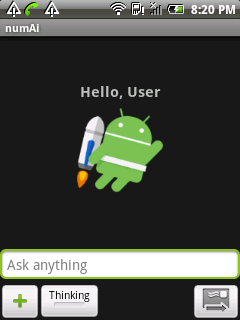
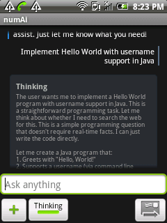
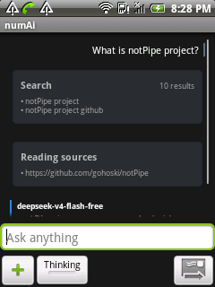
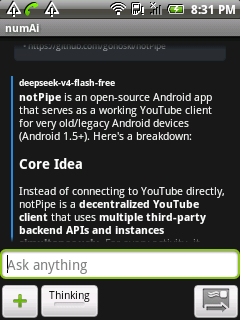
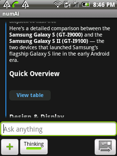
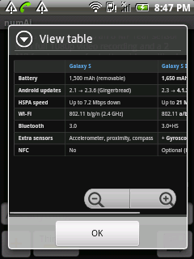
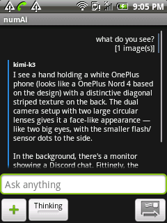
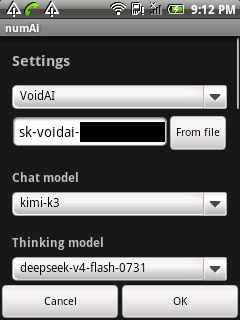

# numAi

[English](README.md) · **Português (Brasil)** · [Русский](README.ru.md) · [简体中文](README.zh.md)

<p align="center">
  
</p>

<p align="center">
  Um cliente leve para vários provedores de IA, compatível com <strong>Android 1.0 ou mais recente</strong>.
</p>

<p align="center">
  <a href="artifacts/numAi-1.0.0-debug.apk?raw=1"><strong>Baixar o último APK de desenvolvimento publicado (1.0.0)</strong></a>
  ·
  <a href="https://github.com/JOAO2666/numAi/releases">Versões publicadas</a>
  ·
  <a href="https://github.com/JOAO2666/numAi/issues">Informar um problema</a>
</p>

> [!IMPORTANT]
> O numAi é um cliente independente. Ele não inclui chaves de API, créditos ou assinaturas. Disponibilidade, preços, limites e recursos dependem de cada provedor e modelo.

## O que o aplicativo faz

O numAi leva conversas com inteligências artificiais modernas desde o primeiro Android até versões atuais, mantendo o APK pequeno e a interface responsiva.

- Conversas compatíveis com o formato OpenAI e respostas em tempo real
- Modelos separados para conversa e raciocínio em cada provedor
- Várias imagens anexadas em modelos com visão
- Markdown, tabelas, blocos de código e fórmulas com MathJax
- Fórmulas de várias linhas usando `$$ ... $$` ou `\[ ... \]`
- Pesquisa na internet pelo Bing ou DuckDuckGo
- Leitura de páginas da internet em versões compatíveis do Android
- Geração em segundo plano com possibilidade de cancelamento
- Chaves, modelos e catálogos armazenados separadamente por provedor
- Prompt de sistema e endereço de API personalizados
- Importação de chave de API por arquivo
- Nova tentativa automática quando um modelo rejeita ferramentas ou opções de raciocínio
- Ferramentas MCP remotas com OAuth 2.0/PKCE e endereço configurável

As fórmulas continuam legíveis mesmo quando o MathJax não consegue carregar. Fórmulas longas podem ser roladas horizontalmente, sem sair da tela.

## Provedores disponíveis

O aplicativo possui configurações prontas para:

| Provedor | Endereço base |
|---|---|
| numAi Oracle | `https://129-148-23-167.nip.io/v1` |
| VoidAI | `https://api.voidai.app/v1` |
| Ollama Cloud | `https://ollama.com/v1` |
| OpenCode Zen | `https://opencode.ai/zen/v1` |
| NavyAI | `https://api.navy/v1` |
| OpenRouter | `https://openrouter.ai/api/v1` |
| NVIDIA NIM | `https://integrate.api.nvidia.com/v1` |
| TokenRouter | `https://api.tokenrouter.com/v1` |
| Groq | `https://api.groq.com/openai/v1` |
| Together AI | `https://api.together.ai/v1` |
| Fireworks AI | `https://api.fireworks.ai/inference/v1` |
| DeepInfra | `https://api.deepinfra.com/v1/openai` |
| Hugging Face | `https://router.huggingface.co/v1` |
| Google AI Studio | `https://generativelanguage.googleapis.com/v1beta/openai` |
| Z.ai | `https://api.z.ai/api/paas/v4` |
| BigModel (Z.ai China) | `https://open.bigmodel.cn/api/paas/v4` |
| Kilo Gateway | `https://api.kilo.ai/api/gateway` |

Também é possível informar um endereço personalizado. Para compatibilidade completa, o serviço deve oferecer os caminhos `/models` e `/chat/completions` no formato OpenAI.

> [!NOTE]
> O numAi remove dos catálogos os modelos conhecidos que não servem para conversa. Suporte a imagens, ferramentas e raciocínio ainda depende do modelo escolhido.

## Instalação

1. Baixe o arquivo [`numAi-1.0.0-debug.apk`](artifacts/numAi-1.0.0-debug.apk?raw=1).
2. Transfira o APK para o aparelho Android.
3. Permita a instalação de fontes desconhecidas quando o Android solicitar.
4. Instale ou atualize o numAi.

O APK de desenvolvimento usa uma assinatura de depuração. Pacotes estáveis, quando disponíveis, ficam na página de [versões publicadas](https://github.com/JOAO2666/numAi/releases).

## Primeiros passos

1. Abra **Configurações**.
2. Escolha um provedor ou informe um endereço de API personalizado.
3. Digite a chave desse provedor.
4. Carregue o catálogo de modelos.
5. Escolha um modelo de conversa e, opcionalmente, um modelo de raciocínio.
6. Volte à conversa e envie uma mensagem.

Escolha um modelo com visão antes de anexar imagens. Caso um provedor rejeite as ferramentas de pesquisa ou opções específicas de raciocínio, o numAi tenta novamente com uma solicitação mais simples e compatível.

### Ferramentas MCP

As Configurações incluem uma conexão MCP configurável. Informe o endereço completo, seguindo o exemplo `https://example.com/mcp`, e autentique com **OAuth** ou com um token/senha Bearer opcional. Marque **Ativar ferramentas MCP nas conversas** para disponibilizar a conexão. Marque também **Executar ferramentas automaticamente** para permitir que o modelo execute as ferramentas sem pedir confirmação a cada ação. Quando essa segunda opção estiver desmarcada, nenhuma ferramenta MCP é enviada ao modelo. Conecte somente servidores em que você confia.

## Segurança das chaves

- Crie uma chave exclusiva para o numAi sempre que o provedor permitir.
- Nunca envie chaves ao GitHub, em relatórios de erro ou em capturas de tela.
- Revogue e substitua imediatamente qualquer chave exposta.
- As chaves ficam armazenadas localmente e separadas por provedor.
- Tokens OAuth e tokens/senhas Bearer do MCP ficam em preferências separadas e nunca são usados como chaves da API de conversa.
- Use HTTPS em todos os endereços personalizados.

## Observações para Android antigo

- Versão mínima: Android API 1
- SDK de compilação e destino: Android API 25
- Alguns provedores HTTPS precisam do [Wolfius](https://github.com/gohoski/Wolfius) em Android antigo, pois o sistema original não possui protocolos TLS modernos e SNI.
- O Bing é a opção de pesquisa mais compatível em aparelhos muito antigos.
- A leitura de páginas e alguns provedores modernos podem exigir Android mais recente ou Wolfius.

## Capturas de tela

<details>
  <summary>Mostrar capturas</summary>
  <br>
  
  
  
  
  
  
  
  
</details>

## Compilação e testes

Ambiente recomendado:

- JDK 8
- Android SDK Platform 25
- Android Build Tools 25.0.0
- Android Studio 2.3.2 para desenvolvimento voltado a aparelhos antigos

Windows:

```powershell
.\gradlew.bat test assembleDebug
```

Linux ou macOS:

```bash
./gradlew test assembleDebug
```

O APK será criado em `app/build/outputs/apk/numAi-2.0-debug.apk`. A versão release passa por redução de código e recursos, mas o APK release gerado não é assinado.

Os testes cobrem provedores, mapeamento de nomes e normalização de resultados MCP, filtragem de modelos, recuperação de incompatibilidades, cancelamento de geração, seleção de modelos, Markdown, MathJax e diferentes formatos de streaming.

## Contribuições e problemas

Abra uma [Issue](https://github.com/JOAO2666/numAi/issues) e informe:

- Versão do Android e modelo do aparelho
- Versão ou commit do numAi
- Provedor e modelo selecionados, sem incluir a chave
- Passos para reproduzir o problema
- Captura de tela ou mensagem de erro sem informações secretas

Pull requests devem manter a compatibilidade com API 1 e evitar dependências pesadas quando o benefício não justificar o aumento do APK e do consumo de recursos.

## Comunidade

- Atualizações no Telegram: [@AppDataApps](https://t.me/AppDataApps)
- Grupo no Telegram: [Retro Android Group](https://t.me/retroandroidgroup)
- Discord: [Android Afterlife](https://discord.gg/2JqfEkQyck)
- 4PDA: [tópico do numAi](https://4pda.to/forum/index.php?showtopic=1116157)

## Agradecimentos

- [How-to-develop-and-backport-for-Android-2.1-in-2020](https://github.com/Mik-el/How-to-develop-and-backport-for-Android-2.1-in-2020), modelo de projeto criado por Michele
- [NNJSON](https://github.com/shinovon/NNJSON), criado por nnproject
- [ReOldAI](https://github.com/YMP-CO/ReOldAi), de YMP Yuri, pela motivação em torno de clientes de IA para Android antigo

## Licença

O numAi usa a licença Do What The Fuck You Want To Public License, versão 2. Consulte [LICENSE](LICENSE).

A biblioteca NNJSON incluída no projeto usa a licença MIT. Consulte [LICENSE-NNJSON](LICENSE-NNJSON).

O robô Android é reproduzido ou modificado a partir de um trabalho criado e compartilhado pelo Google, conforme a [Licença Creative Commons 3.0 Atribuição](https://creativecommons.org/licenses/by/3.0/).
